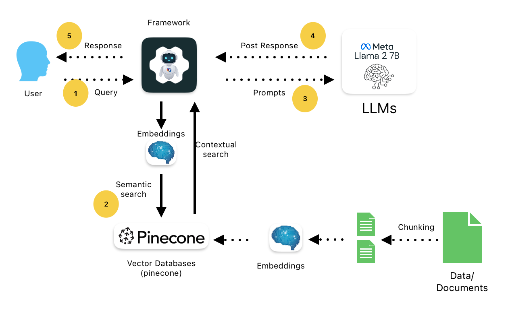
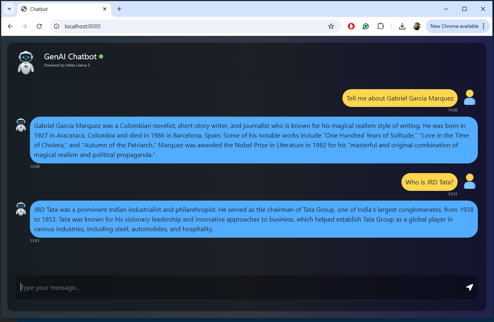

# GenAI-End-to-End-Chatbot [Llama-2-7B + Pinecone]

# How to run?
### Steps :

Clone the repository

```bash
Project repo: https://github.com/vaibhavdhingani/GenAIChatbot.git
```

### Step-1 : Create a python environment after opening the repository
```bash
python -m venv chatbotenv
source chatbotenv/Scripts/activate
```

### Step-2 : install the requirements
```bash
pip install -r requirements.txt
```


### Step-3 : Create a `.env` file in the root directory and add your Pinecone credentials as follows:
```ini
PINECONE_API_KEY = "xxxxxxxxxxxxxxxxxxxxxxxxxxxxx"
PINECONE_API_ENV = "xxxxxxxxxxxxxxxxxxxxxxxxxxxxx"
PINECONE_CLOUD = "xxxxxxxxxxxxxxxxxxxxxxxxxxxxx"
PINECONE_REGION = "xxxxxxxxxxxxxxxxxxxxxxxxxxxxx"
PROXY_URL = "xxxxxxxxxxxxxxxxxxxxxxxxxxxxx"
```


### Step-4 : Download and save the Llama-2-7B in model folder:
```ini
## Llama-2-7B Model: 
llama-2-7b-chat.ggmlv3.q4_0.bin

## Download link:
https://huggingface.co/TheBloke/Llama-2-7B-Chat-GGML/tree/main
```


### Step-5 : Add your pdf content(book, news, article) files which you want to feed to llm in '/data' folder:
```bash
/data/book.pdf or
/data/article.pdf
```


### Step-6 : Execute the python files:
```bash
python store_index.py
python app.py
```
_[This repo has been verified with Python 3.12.5. I have seen few package compilation issues with higher version on Python.]_


### Step-7 : Execute the GenAI Chatbot:
```bash
## Open localhost
open http://localhost:8080/
open http://127.0.0.1:8080/
```




### Stack Used:

- Python
- LangChain
- Flask
- Meta Llama2
- Pinecone